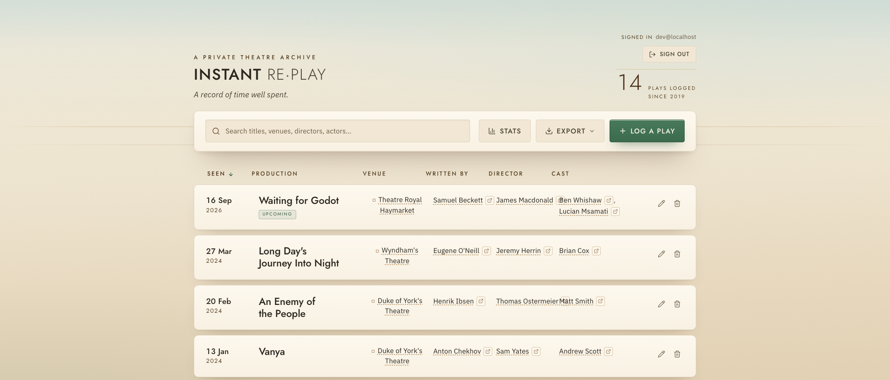

# Instant Re-Play

A private theatre archive. A calm web app for keeping a personal record of every play you have seen, shared by invite with the people you choose.

Live example: it runs behind a passwordless email login, so only invited addresses can get in.



## How it works

**Getting in.** The whole app sits behind a login. You enter your email and receive a one-time sign-in link; clicking it signs you in. There are no passwords. Access is invite-only: only email addresses on a server-side allowlist can get in, and everyone who is invited shares the *same* archive (it is a shared log, not one account per person). A valid sign-in is necessary but not sufficient; the app re-checks that your email is invited on every page, every action, and every download, so nothing is reachable without an invite.

**Logging a play.** From the log you open a form and record a play: its name (the only required field), the date you saw it, the venue, the playwright, the director, and any number of cast members. As you type into the venue, playwright, director, or actor fields, the form suggests names you have used before, so the same person is always spelled the same way. It never overrides you: an unseen name just saves as typed.

**Browsing your archive.** Every play appears in one sortable, searchable list. You can sort by name, date, or venue, and search across everything. Click any venue, playwright, director, or actor and the list filters to every play that shares it, which is how the archive surfaces the connections across your theatregoing. Each person's name also carries a small link to an IMDb search. You can edit or delete any entry.

**Getting your data out.** One click exports the whole archive as a CSV or an Excel (.xlsx) file, so it is always yours to keep and back up.

**Seeing the shape of it.** A stats view reflects your theatregoing back to you: how many plays, how many per year, and your most-seen venues, directors, and actors. It is computed live from your data each time you open it, never stored.

**On your phone.** Add the site to an iPhone or iPad home screen and it installs as a full-screen app with its own icon, opening straight to your log.

### Under the hood

- Pages are server-rendered and read straight from the database; creating, editing, and deleting go through server actions that re-validate everything on the server.
- The plays live in **Postgres** (two tables: `plays`, and `play_actors` for the ordered cast). **Drizzle ORM** is the single query layer. In production the database is **Neon**; for local development the app uses an embedded **PGlite** database on disk, so there is nothing to install.
- **Supabase** provides identity only (the magic-link sign-in and the session). The invite allowlist and every access check run server-side in the app. Supabase does not hold your plays; Neon does.
- Filtering, search, and stats all key on the exact stored text of a name, which is why the entry autocomplete matters: it keeps those names consistent as the archive grows.

## Stack

Next.js (App Router) + TypeScript + React, Drizzle ORM over Postgres (Neon / PGlite), Supabase Auth, a bespoke "Neutra Biorealism" design system (Jost + IBM Plex Sans) with Motion and Lucide, deployed on Vercel.

## Local development

```bash
npm install
npm run seed     # loads a sample archive into a local embedded (PGlite) database
npm run dev      # http://localhost:3000
```

Locally there is no login: with no Supabase environment configured and `NODE_ENV` not set to `production`, the app signs you in as a synthetic development user so you can work on it directly. This shortcut is dead in production, where real auth is always required.

Other scripts: `npm run build`, `npm run test`, `npm run db:generate`, `npm run gen:icons`.

## Environment variables (production)

See `.env.example`. In production, set:

- `DATABASE_URL` — a Postgres connection string (Neon in production).
- `NEXT_PUBLIC_SUPABASE_URL`, `NEXT_PUBLIC_SUPABASE_ANON_KEY` — your Supabase project's URL and public (anon) key.
- `ALLOWED_EMAILS` — comma-separated list of the email addresses allowed to sign in.

Never set a Supabase service-role key; the app does not use one. If the Supabase variables or `ALLOWED_EMAILS` are missing in production, the app fails closed and denies access.

## Deployment

Deployed on Vercel. The build command runs the database migrations against `DATABASE_URL` (see `migrate.mjs`) and then builds. This version has no access control beyond its own login, so keep the deployment reachable only through that login.

## Project notes

`PRODUCT_CONTEXT.md`, `DECISIONS.md`, `ROADMAP.md`, and the `pipeline/` folder hold the product record, the decisions behind it, and the design system. This project was built with [Weft](https://weft.build).
